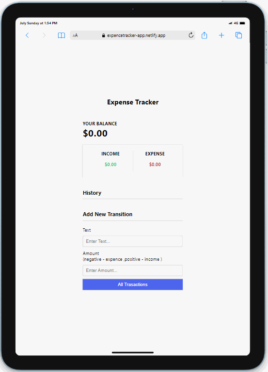

# Project : Expense Tracker

## Description

Project aims to create applications using HTML , CSS, JS

## Project Skeleton

```
Expense Tracker App (folder)
|
|----readme.md         # Definition of the project
|----index.html            # Images of the project
|----style.css
|----script.js

```

## Outcome

🔗 [Camping Website](https://expencetracker-app.netlify.app)



### The following issues are covered in the project;

- HTML

- CSS

- JS

## Resources

- [Images](./Mobile.png)
